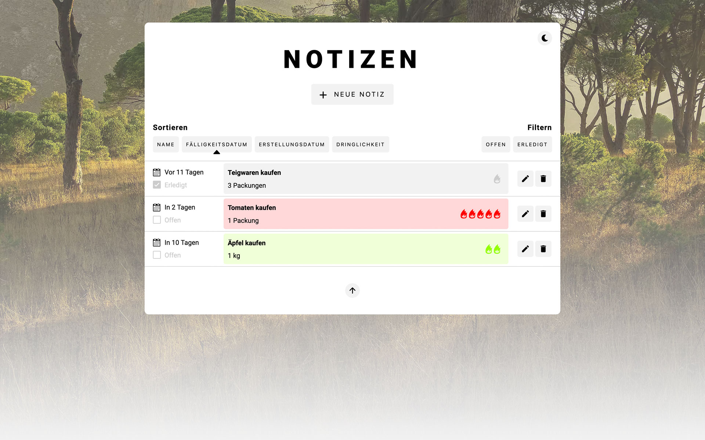

# Notes App • Daniel Blöchlinger

| #   | Command / File             | Description                        |
|-----|----------------------------|------------------------------------|
| 1.  | `npm install`              | Install packages                   |
| 2a. | `npm run start`            | Start server                       |
| 2b. | `npm run dev`              | Start server with nodemon          |
| 3.  | `source/public/index.html` | Open file with WebStorm in browser |